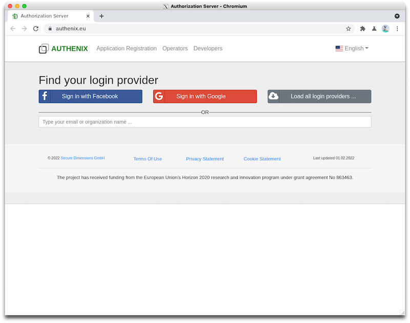
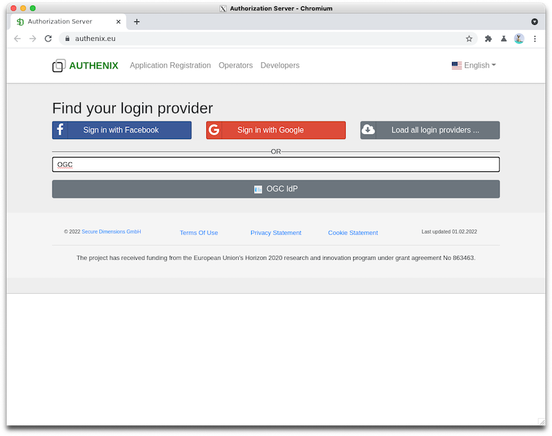
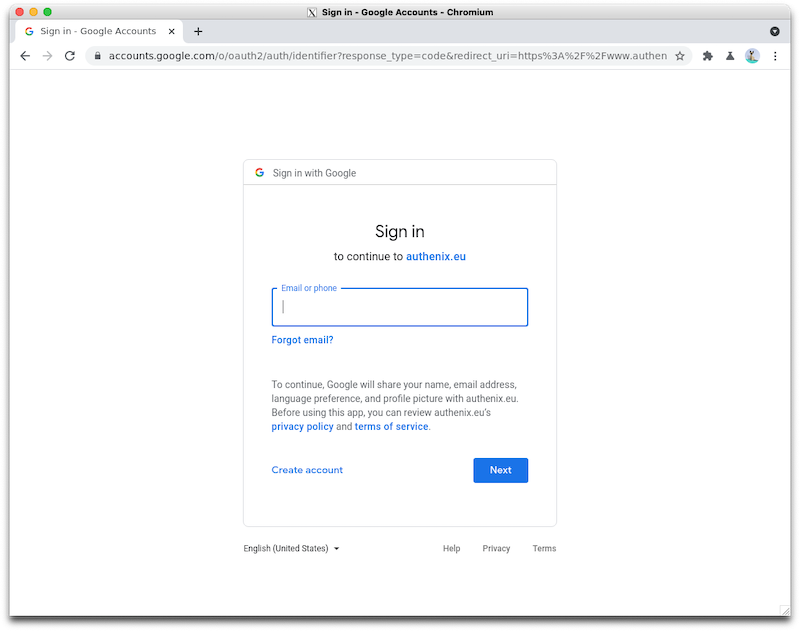
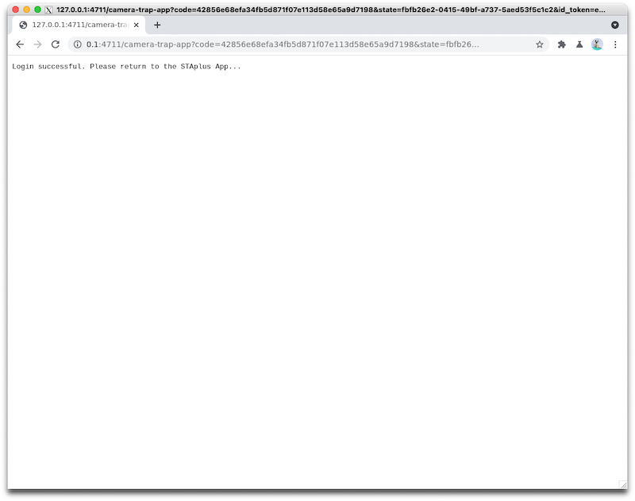
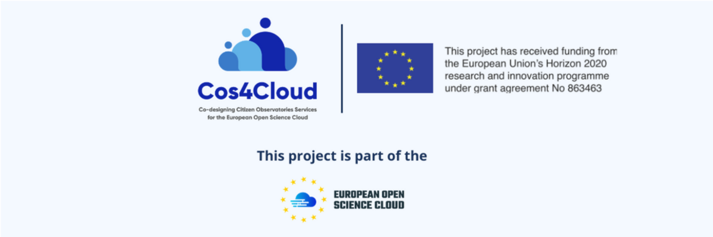

# STAplus App for DynAIkonTrap
*Upload results from running the DynAIkonTrap to a **STAplus** repository.*

STAplus App enables to upload data produced by the Camera Trap App into a SensorThings repository 
that has implemented the STAplus extension as developed throughout the Cos4Cloud project.

The STAplus App, avaiable as *STA.sh* is a proof of work propotype to demonstrate how the picture / video of the
detected animal, the environmental data as well as the location and time to an STAplus endpoint.

The *STAplus* application uses the video created by the DynAiKonTrap app to get a species approximation from
a Secure Dimensions service. Based on the response from the species prediction, the *STAplus* application uploads these 
approximation of species names with likelihood as additional observations.

## Disclaimer
THIS IS EXPERIMENTAL SOFTWARE NOT TO BE SHARED WITH OTHERS.

IT IS ONLY TO BE USED TO VALIDATE THE POSSIBILITY TO UPLOAD
DATA CREATED BY THE DYNAIKON CAMERA TRAP TO A REPOSITORY
BASED ON THE DATAMODEL AND API EXTENSION DEVELOPED BY
 SECURE DIMENSIONS DURING WITHIN THE COS4CLOUD
PROJECT. WHEN CHOOSING A PUBLIC UPLOADING URL, ALL YOUR 
DATA BECOMES AVAILABLE TO ANY USER ON THE INTERNET.

THE UPLOAD OF DATA IS NOT CHECKED, FILTERED OR OTHERWISE
BLURRED TO MEET PRIVACY CONCERNS. YOU ARE RESPONSIBLE TO 
MAKE SURE THAT THE UPLOADED INFORMATION DOES NOT VIOLATE
TO THE LAW AND DOES NOT UNVEIL PRIVATE OR SENSITIVE INFORMATION.

TO BE USED FOR EVALUATION ONLY. 

BY RUNNING THIS SOFTWARE YOU AGREE TO THE DISCLAIMER ABOVE.

## License
The *STAplus* application is available under the [Apache License, Version 2.0](./LICENSE).

## Feedback
The *STAplus* application is part of the work in Cos4Cloud that results in an OGC Best Practices document. 
If you have any aspects you like to share with us, please send an email to info@cos4cluóud-eosc.eu

## Terms of Use and Privacy
**PLEASE BE AWARE OF THE FOLLOWING**

When setting up the camera trap, make sure you are not violating the privacy of others, in paricular
of your neighbours if installed on your premisis.

Please make sure that the camera trap is targeting such that it detects animals. Other content, perhaps falsely 
classified as an animal would be uploaded to the repository. Even though there is controlled access, it is still possible
that the captured photo or video get harevested and published unconstrained on the Internet.


## Getting Started
To execute the *STAplus* application, you may need to have some additional software packages installed.

*The following steps are a starting point, but need to be finalized. Please open a Github issue to clarify
corrections of these instructions*

Follow these steps:
1. Configure a default Web Browser (`sudo update-alternatives --config x-www-browser`)
    - Once you have set the default Web Browser, please verify:
        ```sh
        xdg-open https://cos4cloud-eosc.eu
        ```
1. Please configure the DynAiKonTrap to produce videos (mp4) - see [DynAIKonTrap Readme](../README.md) for more inforamtion
1. Make sure that the `STAplus` file is executeable by typing `chmod +x STAplus` 

## Running the *STAplus* app
You can simply start the application via the command prompt from the dictory where you put the *STAplus* application:

```sh
./STAplus https://cos4cloud.demo.secure-dimensions.de/sta4cs/v1.1
```

## Interacting with the App
When first using the *STAplus* app, you will need to answer questions and agree to terms of use. Once this configuration is finished
any consequitive restart of the app will use this configuration. The configuration is stored in a JSON file 
with the name that is equal to your user's UUID with the extension `.json`. So for example `ff1045c2-a6de-31ad-8eb2-2be104fe27ea.json`.
This config file is read-only but can be removed vi `rm -f` to update the configuration.

Updating the configuration makes sense once the location of the camera trap has changed, or if you like to use different licenses
on your observations.

**You can always stopp the application by typing ^C (CTRL-C)**

### 1. Agree to the Disclaimer and the Terms of Use
First you need to agree to the Disclaimer

`Do you agree to the disclaimer? Please type 'y' to agree. [n]:`

In case you type `n` the application will exit.

### 2. Initiate Login
Next, you need to login. This is done with the Authentication Service [AUTHENIX](htps://www.authenix.eu).

`Opening your default Web Browser (Chromium Web Browser) to login via AUTHENIX ...` 

Please go to your default Web Browser, e.g. Chromium, and continue the login process.

### 3. Login
In case you login for the first time, AUTHENIX will ask you to agree to the Cookies.

After that you see the following window where you can select the login provider:



If you like to login via an existing **Facebook** or **Google** account, please select the correspondng button. In case you like to login via an University login,
please type the name of your University (or parts of it) into the search box. It is also possible to login via the **OGC** portal account. Please type `OGC` into the 
search box and select the displayed result.



After you select *Google* for example, you will see the following screen where Google asks you to login.



*The login is with Google - AUTHENIX does not get your login credentials!*

### 4. Login Success
After you login completed successfully, you will see the following window:



You see that the *STAplus* prints your name as greeting.

### 5. GPS Location
After a successful login, the *STAplus* application uses the attached sensor board to determine the GPS location of the Camera Trap.

```
Sensor Board found at USB0
Determining GPS location, please wait (max. 20 seconds)...
``` 

The process of getting the GPS location can take some time, depending when you attached the sensor board, the visability to the sky, etc.
After 20 seconds, the app either has received a GPS location from the sensor board or it will ask you if it shall retry.

Assuming the GPS location was determined, the position is printed. For example: 

`GPS location determined is LAT=48.11 LON=11.51` 

Next, you have three choices:

```
To accept this location please type 'y'. If location is empty or not correct, please type 'r' to repeat the GPS position check. 
If Sensor Board was recently connected or no free visual to the sky is present, it can help to repeat the process multiple times. 
You can set the location manually if automatic position determination is not possible by typing 'e' [n]
```

* 'y': You acceppt the printed position for further processing
* 'e': You input the position via keyboard
* 'n': You want the app to repeat the GPS positioning again

### 6. Address and Geographic Area
Once you accepted the determined GPS locaation or you provided it manually, the *STAplus* application determines the address via OSM 
so that you can verify the GPS location.

```
The GPS location will now be associated to the OSM municipality level "Major Roads".
The following information was received:
Latitude: "48.11136893574673"
Longitude: "11.512240109099217"
Display Name: "Waxensteinstraße, Am Waldfriedhof, Sendling-Westpark, München, Bayern, 81377, Deutschland"
Bounding Box: [ "48.110765", "48.1118293", "11.5056037", "11.5158748" ]
Polygon: { "type": "LineString", "coordinates": [ [ 11.5158748, 48.1118293 ], [ 11.5147233, 48.111672 ], [ 11.513814, 48.1115661 ], [ 11.5128571, 48.1114405 ], [ 11.5126163, 48.1114075 ], [ 11.511673, 48.1113108 ], [ 11.5105932, 48.1111941 ], [ 11.5096863, 48.1110978 ], [ 11.5088026, 48.1109902 ], [ 11.5078907, 48.110907 ], [ 11.5066946, 48.1108377 ], [ 11.5056037, 48.110765 ] ] }
```

Now, you need to tell the application how to record the position. You have two choices:

* You can use the exact GPS location: All observations of species detection will contain the LAT / LON position. **Be aware that any user that is
requesting an observation will see the eact location** Please make your mind up if that bothers you.
* You can use the boundary of your municipality area as printed above as `Polygon`

```
You have the choice to associate the exact GPS location or the municipality area with your Camera Trap. 
If you select the exact position, you will have the opportunity to edit the location. 
This should be done if being concerned to publish your exact GPS location. 
You could for example remove some last digits to decrease the GPS location's accuracy.
If you like to use area represented by the polygon above, please type 'p'. 
If you like to use the exact GPS location, please use 'l' [p]:
```

### 7. Project Setup
All observations that are created by your Camera Trap will be associated to a Project. It is your Citizen Science project, so please provide a name and description.

`Please provide information how you like to describe your activity` 

```
Please provide the name for your project [Species Detection by DynAIkon Camera Trap]:
```

e.g.: `LJS Species Detection Project` 

```
Please provide the description for your project [The automatic detection of species by all participating camera traps]: 
```

e.g.: `The automatic detection of species by my Camera Trap`

### 8. Select a License
The Camera Trap produces different pieces of information, stored as observations. 
You have the choice to mark your observations based on [Create Commons](https://creativecommons.org) licenses.
This is important as it tells others under which conditions they can re-use your observations.

```
You need to select the license for the video / photo capture of the detected animal. Please choose from the following licenes:
"license no. 0: CC_PD, CC0 Universal (CC0 1.0) Public Domain Dedication, https://creativecommons.org/publicdomain/zero/1.0/, Attribution to null"
"license no. 1: CC BY 3.0, The Creative Commons Attribution license, https://creativecommons.org/licenses/by/3.0/deed.en, Attribution to null"
"license no. 2: CC BY-NC 3.0, The Creative Commons Attribution-NonCommercial license, https://creativecommons.org/licenses/by-nc/3.0/deed.en, Attribution to null"
"license no. 3: CC BY-SA 3.0, The Creative Commons Attribution & Share-alike license, https://creativecommons.org/licenses/by-sa/3.0/deed.en, Attribution to null"
"license no. 4: CC BY-NC-SA 3.0, The Creative Commons Attribution & Share-alike non-commercial license, https://creativecommons.org/licenses/by-nc-sa/3.0/deed.en, Attribution to null"
"license no. 5: CC BY-ND 3.0, The Creative Commons Attribution & NoDerivs license, https://creativecommons.org/licenses/by-nd/3.0/deed.en, Attribution to null"
"license no. 6: CC BY-NC-ND 3.0, The Creative Commons Attribution & NonCommercial & NoDerivs license, https://creativecommons.org/licenses/by-nc-nd/3.0/deed.en, Attribution to null"
Please type the license no.:
```

e.g.: `4` would require that you get attributed, the video / photo cannot be used commercially and the further sharing must be based on the same conditions.

```
You need to select the license for the air measurements. Please choose from the following licenes:
"license no. 0: CC_PD, CC0 Universal (CC0 1.0) Public Domain Dedication, https://creativecommons.org/publicdomain/zero/1.0/"
"license no. 1: CC BY 3.0, The Creative Commons Attribution license, https://creativecommons.org/licenses/by/3.0/deed.en"
"license no. 2: CC BY-NC 3.0, The Creative Commons Attribution-NonCommercial license, https://creativecommons.org/licenses/by-nc/3.0/deed.en"
"license no. 3: CC BY-SA 3.0, The Creative Commons Attribution & Share-alike license, https://creativecommons.org/licenses/by-sa/3.0/deed.en"
"license no. 4: CC BY-NC-SA 3.0, The Creative Commons Attribution & Share-alike non-commercial license, https://creativecommons.org/licenses/by-nc-sa/3.0/deed.en"
"license no. 5: CC BY-ND 3.0, The Creative Commons Attribution & NoDerivs license, https://creativecommons.org/licenses/by-nd/3.0/deed.en"
"license no. 6: CC BY-NC-ND 3.0, The Creative Commons Attribution & NonCommercial & NoDerivs license, https://creativecommons.org/licenses/by-nc-nd/3.0/deed.en"
Please type the license no.:
```

e.g.: `1` would only require to attribute you when reusing the environment measurements from your sensor board.

After this input, the *STAplus* app creates the configuration file and starts processing files created by the DynAIKon Camera Trap...

### 9. Start Processing
The *STAplus* app scans the current directory for `*.vtt` files. If the app finds such a file, it processes the content and uses the `*.mp4`.
To continue processing, the *STAplus* app detaches and continous as a background application.

```
Start processing data. Checking for new files every 30 seconds...
App continous with pid <number>
To stop the processing, type: kill <number>
```

The `<number>` is a placeholder for the actual. E.g. `App continous with pid 1587`.

Once a `*.vtt` file is processed, the *STAplus* application renames the file to:

* `*.vtt.ok` to indicate that the processing went OK and that the corresponding observations got uploaded. 
* `*.vtt.error` to indicate that the processing ended with an error.

You can determine more details about this from the `*.log` file.

### 10. Logging
The *STAplus* app prints quite some (debugging) information to the system log. You can see the information by typing 

```
tail -f /var/log/messages
```


---


