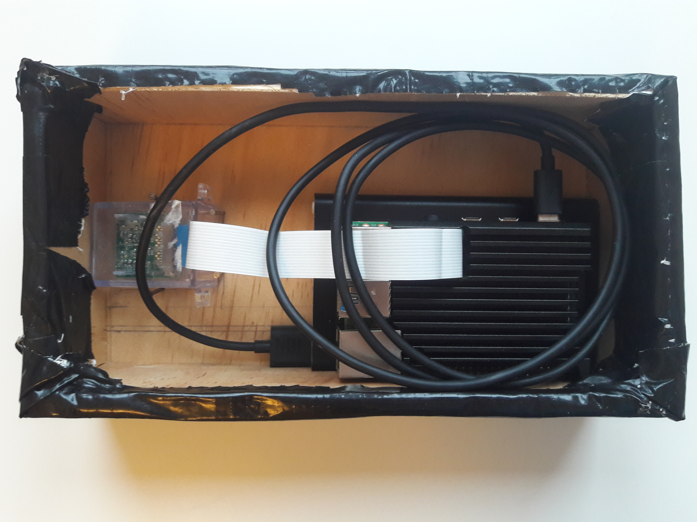

Assembly and Deployment
=======================

You will need...
----------------
* Raspberry Pi (model 4 is recommended, although other models may work)
* Micro SD card (and an adapter to flash the SD from your computer)
* Power supply for the Raspberry Pi
* Camera (tested with the Raspberry Pi Camera Module; you should use a camera that can connect to the Pi's CSI slot with a ribbon cable)
* Ethernet cable, if you won't use Wi-Fi

for a minimal camera trap setup.

Deploying
---------

The versatility of this platform means it can be deployed in many different situations. What follows is a general description of factors to consider when deploying the system.
Power

.. important::
   
   Whatever power solution you choose, make sure it is not limited to 1A, as the current draw may exceed this at times.

Quite a major aspect of in-the-field deployment for the system is the power supply. A Raspberry Pi may sound like a very lightweight system, but remember that it's set to run for 24 hours a day. As a simple napkin calculation consider that the full system draws between 0,7A and 1A; to keep things simple assume a current draw of 1A. As the device runs at 5V, that equates to a power consumption of 5W. Over 24 hours that is an energy consumption of 120Wh. For comparison boiling a kettle uses around 70Wh [`reference <https://doi.org/10.1016/j.apenergy.2016.03.038>`_], which means using the camera trap is equivalent to boiling the kettle 1,7 times a day.

In order of simplicity here are some suggestions for powering the system:

#. Mains electricity
#. Batteries e.g. a mobile phone power bank

   * Ideally this should be able to output more than 1A to cater for any spikes in power consumption
   * Remember the capacity (Ah) tells you how long the camera trap will stay alive for

#. A standalone power supply, consisting of:

   * A solar panel (~100W)
   * Battery e.g. 12v lead-acid (~65Ah)
   * MPPT charge controller

The first two options are fairly simple to set up. The final option is a bit more involved and it is worth reading some guides on these kinds of systems before proceeding. A useful reference can be found `here <https://doi.org/10.1111/2041-210X.13456>`_.

.. warning::
   
   If you are using battery power make sure you either switch off the system (e.g. via SSH) before removing power, or before the battery is depleted. If you do not do this, the SD card could become corrupted (it might not) and you'll have to possibly reformat the SD card.

Casing
^^^^^^

If you wish to place your camera trap outdoors it might be worth putting it in some form of enclosure. Of course, you may want to deploy it indoors looking out. There are many options you may opt for, anything from a tupperware container to a custom-made case (wood, or 3D-printed). When you choose your case of choice make sure you have considered the following:

* Do you need waterproofing?

  * To protect from rain
  * Also protect from dew and other sources of water

* Is protection/camouflage from animals needed?
* Could the Raspberry Pi overheat in the case

  * This may happen if the case is in direct sunlight with no form of ventilation

* How big does it need to be?

  * Leave enough space for The Raspberry Pi, camera, sensors, battery, and anything else you may want

Here is an example case constructed from wood:

.. image:: ../_static/wood_case_front.jpg
   :width: 400
   :alt: Front of case

In this case the camera has been fixed in place by four pins that have been partially hammered into the front panel from the inside. The Raspberry Pi and mobile phone power bank are placed in loosely. The outside is wrapped in duct tape to make the enclosure water resistant. A back panel can be screwed in place so it is easy to open and close the case and an extra strip of duct tape is used to cover the gaps left between back lid and the main case. All the other walls are assembled using glue and pins. There is a small hole in the front of the case for the camera to look out of. If you want to use built-in lighting you'll need to drill extra holes for this.

The pictured case has external dimensions of 210x110x70mm. The wood is 7mm thick.

Lighting
^^^^^^^^

It is up to you whether you want your camera trap to work at night. If you do, the first consideration is whether you want to use white or infra-red lighting. The former means you can use the standard Raspberry Pi camera and colours will appear natural. The downside is that the camera trap is not very covert and, as studies have shown, this can affect how animals behave around your camera trap. To get a deeper insight into animals' normal behaviour consider using infra-red lighting. This also makes it harder for other humans to spot the device so it is less likely to be stolen. Either way you should be using LEDs, as incandescent light bulbs will be too power hungry. Remember, you will need to make sure your camera can see in the infra-red domain. This means either buying one of the official IR cameras, or removing the IR filter yourself (at your own risk!).

Next, consider how intense the lighting should be; are you watching birds inside a birdhouse, or watching foxes a few metres away? Depending on which of these is true, you will need more or fewer LEDs. Many online retailers will offer products according to the search query "CCTV infra-red light". These are usually 12v lights with a built-in light sensor so they come on automatically in the dark. This means they can be mounted independently of the camera trap, powered by batteries or the electricity mains.

If you are looking to mount the lighting within the camera trap housing, consider `this camera <https://thepihut.com/products/raspberry-pi-night-vision-camera-ir-cut>`_, which is powered via the Raspberry Pi and can automatically switch between day and night mode.

Location
^^^^^^^^

Any camera trap's performance is highly dependant on location. Assuming you want to maximise the number of animal images taken, you should find a spot that is likely to have lots of animal activity. There are many online guides out there for this and it may be worth reading some of these. Alternatively, just use some common sense and give the placing of the trap some consideration.

This camera trap works by analysing the input video stream from the camera. Part of this analysis involves looking at movement in the image and so lots of background movement will trigger excessive processing and cause a longer delay before you see the results. For this reason it is important that the camera trap is fixed in place, for example strapped to a tree. If the camera trap shakes, this will look like movement in the image from the camera's perspective. You should also make sure that the scene in the camera's field of view does not experience lots of non-animal motion. If this cannot be avoided, consider increasing the movement thresholds in the trap's settings.

Putting It All Together
-----------------------

Before you invest time into the assembly of the camera trap it's best to try out the provided code first. That way you know if there are any problems and can address these before starting to build a case etc.

It's advisable to design the case with lots of spare space if this is your first one. That way you won't be annoyed when that one thing you forgot about in the case design process won't fit into the finished case. Consider what components you will need based on the above sections and draw a sketch of how they might fit together (with dimensions), or just physically play around with organising the actual components. Once you know what volume the components will take up, make your case. You may want to stuff everything inside a tupperware container, or spend some time making a custom case.

With the camera trap assembled perform one more check that everything works. In particular, ensure the camera is aligned with the hole so the camera is not blocked by the case. Make sure you have Wi-Fi enabled or disabled depending on whether or not you want to use it. Then head out to your location of choice. If your are planning to use your trap via Wi-Fi, make sure it is within reach of the router and set up the trap. If you are opting to start it via Ethernet you'll need to start the code before closing the trap case. It is strongly recommended to set up the Raspberry Pi in "headless" (no directly attached monitor) mode with an SSH connection over Wi-Fi or Ethernet as it not advisable to carry a monitor and keyboard to an area where you might want to place the trap.

To mount the trap make sure the camera is angled such that an area of interest is within view. If you are observing a particular area like a fox burrow entrance, consider leaving space for the animal to move around. Placing the camera slightly further away will allow you to capture more of the animal in a frame, but you may lose some close-up details. You could power the trap via mains electricity if you have a power socket outdoors, but make sure to waterproof any outdoor electrical devices. If you mount the trap in such a way it could stay deployed for quite a long time period. In that case it is worth checking on results regularly at the start to make sure everything is working well. It is worth downloading images and videos from the camera trap using the standard :command:`scp` program.

